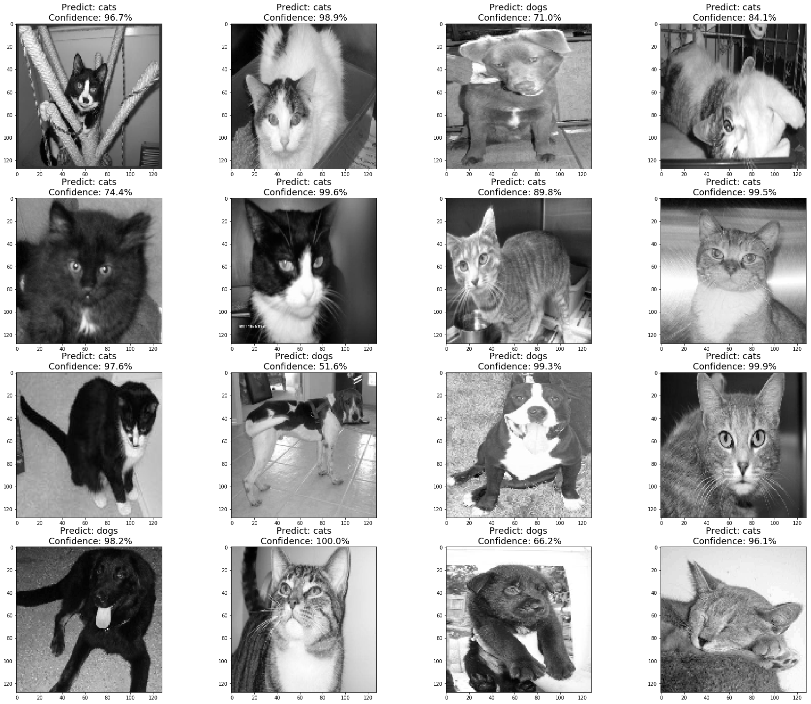

# Dog and Cat Classification
Distinguish images of dogs from cats using custom CNN network and Transfer Learning with Keras.

**Dataset:** [cat and dog dataset](https://www.kaggle.com/datasets/tongpython/cat-and-dog)

## 1. Custom CNN Network**
### Table:
* **Introduction**
* **Configuration**
* **Read & Preprocessing the Data**
* **CNN Network**
    * **Training**
* **Evaluation**
* **Results**
* **Testing Visualization**

* **Other Solutions (TL)**

## 2. Transfer Learning (MobileNet)

### Table:
* **Introduction**
* **Configuration**
* **Read Data**
* **Data Visualization**
* **Transfer Learning**
    * **Training**
* **Results**
* **Other Solutions (CNN)**

Copy & Edit directly **[Kassem@elcaiseri](https://kaggle.com/elcaiseri):**

1. [Keras | CNN Dog or Cat Classification](https://www.kaggle.com/code/elcaiseri/keras-cnn-dog-or-cat-classification)
2. [Transfer Learning (CAT vs DOG)](https://www.kaggle.com/code/elcaiseri/transfer-learning-cat-vs-dog)
